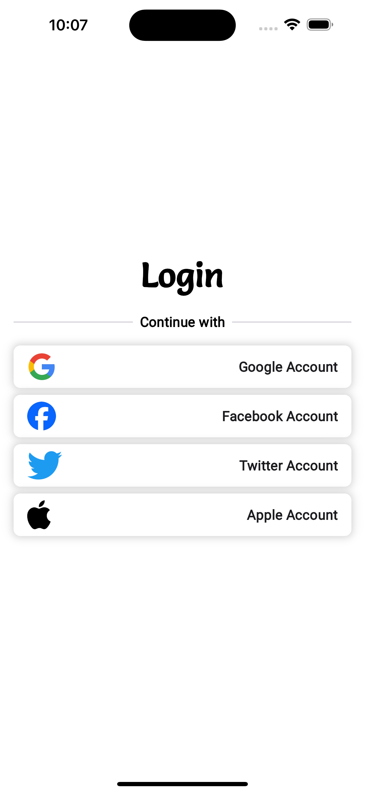

# ChatApp

ChatApp is an application that primarily interacts with Firebase to authenticate users, store data, and send notifications to users. These are the current descriptions I've come up with, and I will update the information daily as the project develops. Some features of ChatApp:

## Features of ChatApp:
1. **Login/Logout**: Login with Google, Facebook, Apple, and Twitter accounts.
2. **Data Storage**: Store user data through Firebase Storage.
3. **Notifications**: Send notifications to user devices.

## Get Started

Clone and open the project in your IDE and run the following command in the project's terminal to install the necessary packages:

```sh
flutter pub get
```

Next, take some time to read the documentation at [Firebase](https://firebase.google.com). This will help you easily solve any issues you might encounter when working with Firebase.

Finally, hopefully there are no bugs left, select a simulator on your IDE and press `F5` to start the project.

## App Screens
- **Splash Screen / Login Screen**
<div align="center">
    
    
</div>

- **Home Screen**
<div align="center">
    
</div>

Thank you for your positive interactions that help me develop this application. Don't hesitate to do so.